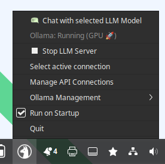

<p align="center">
  
</p>


# LLM Tray Manager

A lightweight system tray application for Linux to manage local LLM (Large Language Model) servers using **Ollama** and **Docker**. 

It serves two main functions: 
1. Docker based Ollama management (status, pull model, remove model etc.)
2. Quick chat interface accessible from system tray. 

Currently, the program works with the Ollama Docker image. More LLM servers will be added in the future.

It was designed for status checking, but it serves well as a quick LLM chat interface available in the taskbar. 
The chat interface was designed to talk with multiple installed models at once. 
As such, it is very useful for quick brainstorming tasks when you want to access all the strengths of different installed AI models.  


## Functions and GUI


### Status checking 
System tray icon and status checking is done in the taskbar. When GPU is available in Ollama it shows round circle around Lama. 


When Ollama is using CPU: 


When Ollama is using GPU: 


When there is no docker container with Ollama running: 


These statuses were the main reason why I created this app. 

### Taskbar and functions overview
On **right click** you will get menu to access basic functions. Currently there is: 

1. Open chat window with model. 
2. Start and stop (docker container running Ollama)
3. Select main chat model (Select LLM model)
4. Function to pull LLM model for Ollama
5. Remove LLM model 
6. Check interval (for working docker image and hardware type used)
7. Name select for docker image (in case it is different as Ollama)
8. Add a program to startup programs
9. Quit



### Chat interface

The Chat interface can be invoked by left-clicking the status icon or using the menu option. 
It's a simple interface with a twist: it sends the same prompt to multiple models that can be selected using the dropdown menu. 
This allows you to gather info from multiple AI models running in the background. It features syntax highlighting for code blocks.


  

## Demo Video 

Here is a quick overview of the application in action:


https://github.com/user-attachments/assets/4ee96f3e-75c8-4be9-a838-429e1794580b


## Features

*   **System Tray Indicator**: Visual status of your Ollama container (Stopped, Running on CPU, Running on GPU). Detection is done by checking the Docker process list giving square around lama icon if CPU and round for GPU. 
*   **Control**: Start and Stop the Ollama Docker container easily.
*   **Model Management**: Pull new models and select which model to run.
*   **Chat Interface**: A built-in chat window with syntax highlighting for code blocks.
*   **Docker Integration**: Works with existing Docker setups or Docker Compose.

## Prerequisites

*   **Linux** (Tested on Debian/Ubuntu based systems)
*   **User permissions**: Ensure your user is in the `docker` group (`sudo usermod -aG docker $USER`).
*   **Docker** installed and running.
*   **Docker nvidia container runtime** for GPU support (if you're using a machine with a GPU).
*   **Python 3**

## Installation

### Option 1: Install via Debian Package (.deb)
Check the [Releases](https://github.com/GSkrt/LLM-tray-manager-and-chat/releases) page for the latest `.deb` file.

```bash
sudo dpkg -i llm-tray-manager_1.0-1_all.deb
sudo apt-get install -f  # To fix any missing dependencies
```

### Option 2: Run from Source

1.  Clone the repository:
    ```bash
    git clone https://github.com/GSkrt/LLM-tray-manager-and-chat.git
    cd llm-tray-manager
    ```

2.  Install dependencies:
    ```bash
    pip install -r requirements.txt
    ```
    *Note: On some Linux distributions, it is recommended to install PyQt5 via your package manager (e.g., `sudo apt install python3-pyqt5`).*

3.  Run the application:
    ```bash
    python3 llm_tray_manager.py
    ```

## Usage

1.  Launch the application.
2.  Right-click the tray icon (Llama head).
3.  Select **Start LLM Server** if it's not running.
4.  Select **Chat with selected LLM Model** to open the chat interface.

## License

This project is licensed under the GPLv3 License - see the LICENSE.txt file for details.
